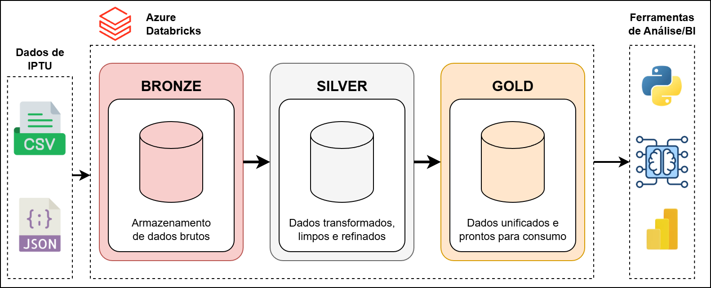

# Desafio Neurotech

- Vaga: Analista de Dados II (Engenharia)
- Candidato: Douglas de Farias Medeiros
- Desafio: Orquestração e Análise dos Dados de IPTU do Recife

Para o desafio, foram considerados os dados brutos de IPTU da cidade do Recife, fornecidos pela empresa Neurotech, em formato CSV e JSON. Além disso, foi utilizada a arquitetura medalhão e a ferramenta Databricks na sua versão gratuita para desenvolvimento dos pipelines de ingestão e transformação dos dados com PySpark e um notebook com a análise dos dados tratados.

O diagrama da solução de dados desenvolvido está ilustrado na imagem abaixo:

A orquestração do pipeline de dados foi realizada por meio do workflow de um Databricks (arquivo wflow_ingestao_dados_IPTU.yaml disponível neste repositório) que executa o notebook principal chamado _04_ingestao_dados_. Este notebook atua como controlador do pipeline de ingestão de dados, orquestrando a execução sequencial dos notebooks que compõem as etapas da arquitetura em camadas. São invocados, em ordem, os seguintes módulos: *01_ingestao_camada_bronze*, responsável pela ingestão bruta dos dados, *02_ingestao_camada_silver*, encarregado da transformação e refinamento dos dados e *03_ingestao_camada_gold*, que realiza a unificação das tabelas e disponibiliza os dados para consumo analítico.

Para testar os notebooks desenvolvidos, execute os passos a seguir:

1. Baixe na sua máquina os arquivos fornecidos para o desafio ([Dados de IPTU (2020 - 2023)](https://github.com/Neurolake/challenge-data-engineer/tree/main/iptu_20_23) e [Dados de IPTU (2024)](https://github.com/Neurolake/challenge-data-engineer/blob/main/iptu_24/iptu_2024_json.zip))
2. Descompacte os arquivos e faça upload no caminho do databricks: /Volumes/workspace/default/dados_iptu
3. Execute o notebook _04_ingestao_dados_, o qual vai realizar a ingestão, transformação e refinamento dos dados nas camadas bronze, silver e gold
4. Execute o notebook _05_analise_dados_ para verificar todas as análises que foram realizadas

Para a transformação de dados foram definidos critérios de qualidade e diversos passos de limpeza, todo o log do passo a passo de execução pode ser observado no notebook _04_ingestao_dados_ após a sua finalização.

Também foi deixado neste diretório uma cópia do dataframe final com todos os dados tratados e unificados, no arquivo dados_iptu_unificado.zip.
